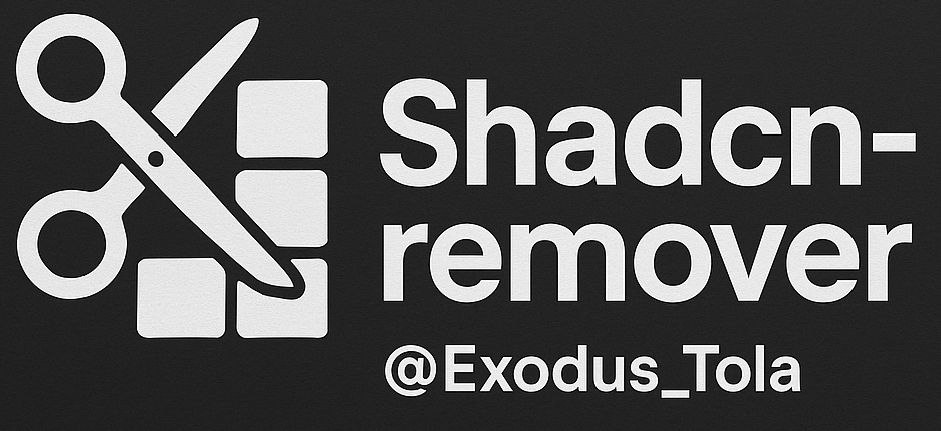

# shadcn-remover CLI

<!-- Badges -->
<p align="center">
  <a href="https://www.npmjs.com/package/shadcn-remover">
    
  </a>
  <a href="https://opensource.org/licenses/MIT">
    
  </a>
  <a href="https://nodejs.org/en/download/current/">
    
  </a>
  <a href="https://github.com/exodus-tola-mindCoder/shadcn-remover/issues">
    
  </a>
  <a href="https://github.com/exodus-tola-mindCoder/shadcn-remover/stargazers">
    
  </a>
</p>

---

<p align="center">
  
</p>

<h1 align="center">shadcn-remover CLI</h1>

<p align="center">
  <b>A powerful and user-friendly CLI tool to efficiently remove Shadcn UI components from your project.</b>
</p>

---

<p align="center">
  <b>🌟 If you find this project helpful, please consider giving it a ⭐ on <a href="https://github.com/exodus-tola-mindCoder/shadcn-remover">GitHub</a>! 🌟</b>
</p>

<p align="center">
  
</p>


---

## ✨ Features

- **Remove Specific Components:** Target one or more components by name.
- **Remove All Components:** Option to remove all detected components at once.
- **Interactive Mode:** Select components to remove from a list if none are specified.
- **Dry Run:** Preview which files/directories would be removed without making changes.
- **Flexible Detection:** Handles both file-based (`button.tsx`) and directory-based (`dialog/`) component structures.
- **User-Friendly:** Provides clear feedback with progress spinners and colored output.
- **Safe:** Includes confirmation prompts before deleting files.
- **Lightweight & Fast:** Built with modern tools for efficiency.

---

## ⚙️ Requirements

- **Node.js:** Version 18.0.0 or higher (`>=18.0.0`)
- **npm** (or yarn/pnpm)

---

## 🚀 Installation

Install the tool **globally** using your preferred package manager:

```bash
# Using npm
npm install -g shadcn-remover

# Using yarn
yarn global add shadcn-remover

# Using pnpm
pnpm add -g shadcn-remover
```

---

## 💡 Usage

Navigate to the root directory of your project in your terminal and run the command:

```bash
shadcn-remover [components...] [options]
```

### Arguments

- `[components...]`: (Optional) A space-separated list of component names to remove (e.g., `button card dialog`).

### Options

| Option       | Alias | Description                                              | Default |
|--------------|-------|----------------------------------------------------------|---------|
| `--all`      | `-a`  | Attempt to remove all detected Shadcn UI components      | `false` |
| `--dry-run`  | `-d`  | Show what would be removed without actually deleting     | `false` |
| `--version`  | `-V`  | Display the version number                               |         |
| `--help`     | `-h`  | Display help information                                 |         |

### Examples

```bash
# Remove specific components (button, alert-dialog, sheet)
shadcn-remover button alert-dialog sheet

# Remove all components (will prompt for confirmation)
shadcn-remover --all

# Start interactive mode (prompts you to select components)
shadcn-remover

# Dry run: See what would happen if you removed the 'card' component
shadcn-remover card --dry-run

# Dry run: See what would happen if you removed all components
shadcn-remover --all --dry-run
```

---

## 📁 Configuration

By default, `shadcn-remover` expects your Shadcn UI components to be located in:

```
<your-project-root>/src/components/ui/
```

Ensure you run the command from your project's root directory for the path detection to work correctly.

---

## 🤝 Contributing

Contributions, issues, and feature requests are welcome! Feel free to check the [issues page](https://github.com/exodus-tola-mindCoder/shadcn-remover/issues).

### Steps to Contribute

1. Fork the Project
2. Create your Feature Branch (`git checkout -b feature/AmazingFeature`)
3. Commit your Changes (`git commit -m 'Add some AmazingFeature'`)
4. Push to the Branch (`git push origin feature/AmazingFeature`)
5. Open a Pull Request

---

## 👤 Author

**Exodus-Tola**

- GitHub: [@exodus-tola-mindCoder](https://github.com/exodus-tola-mindCoder)

---

## 📜 License

This project is licensed under the MIT License - see the [LICENSE](./LICENSE) file for details.

---

## 🏷️ Keywords

`cli`, `shadcn`, `shadcn-ui`, `ui`, `components`, `remove`, `delete`, `cleanup`, `utility`, `tool`, `nodejs`

---

## 🌟 Support

If you find this project helpful, please consider giving it a ⭐ on [GitHub](https://github.com/exodus-tola-mindCoder/shadcn-remover)!

---

## 📢 Stay Updated

Follow the repository to stay updated with the latest features and improvements. Suggestions and feedback are always welcome!
